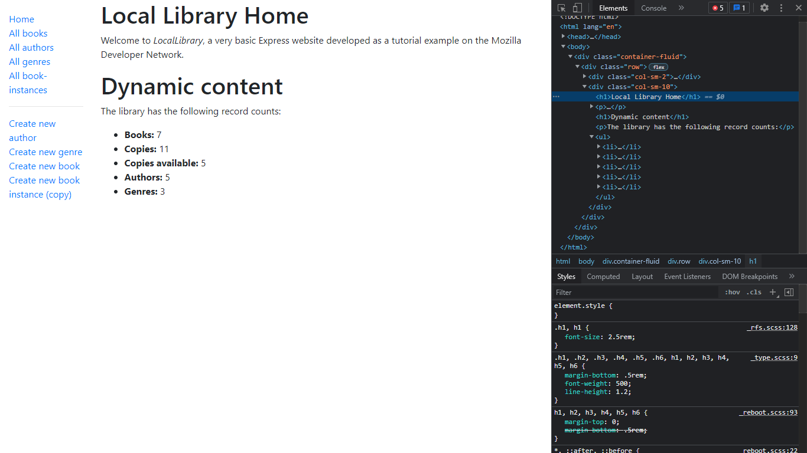
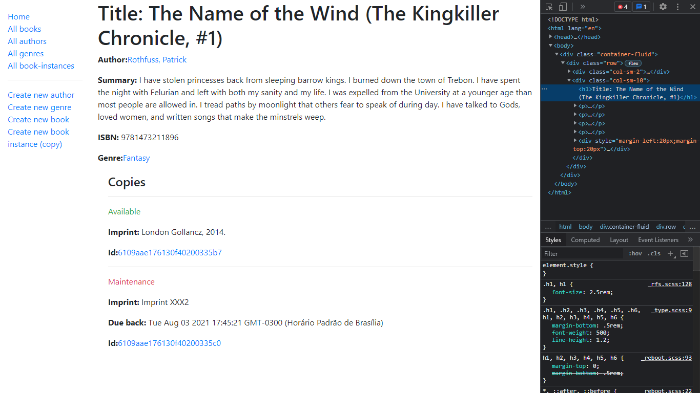
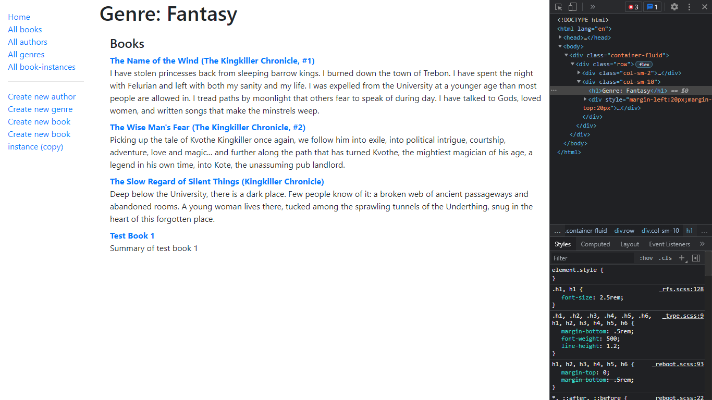
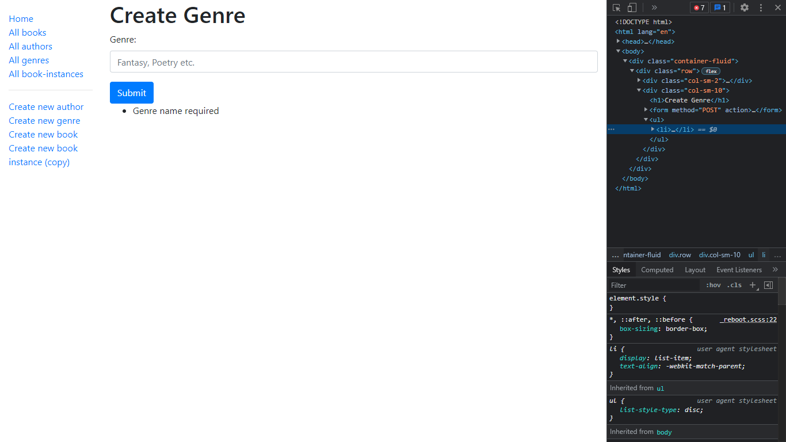
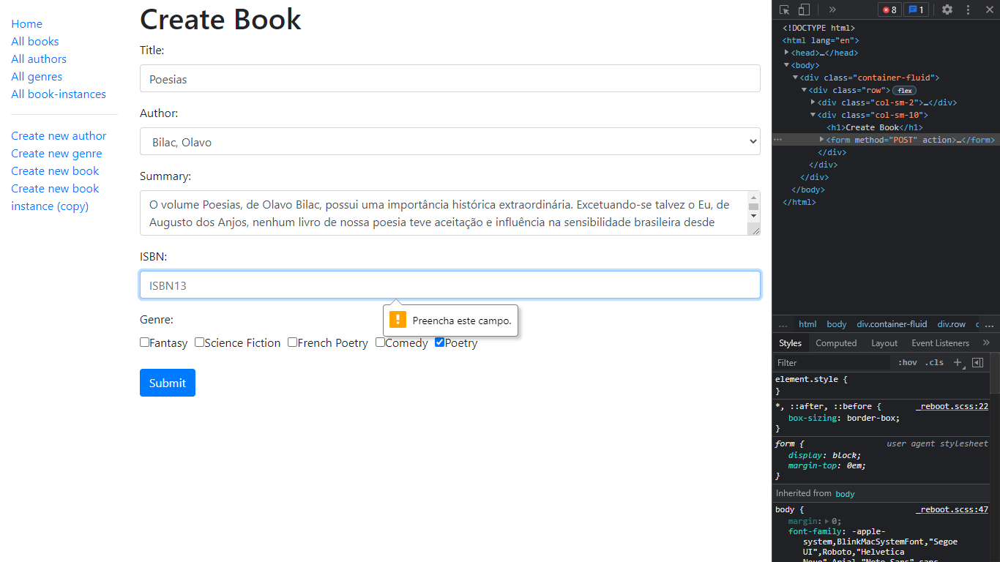

# Express Local Library website

Projeto de desenvolvimento backend to create a small library web page using Node-JS and Express-JS. [^1]

Dependências:

- Express-JS
- Pug view
- Nodemon
- Morgan
- MongoDB
- Mongoose
- Async
- Luxon (date formatter)
- Express-validator 
	- Validating and Sanitizing forms
- Compression (to improve production)
- Helmet (to improve production)	

### Local Library Home page image:

### Book description page:

### Book genres list:

### Exemplo de validação de input com express-validator:

### Outro exemplo de validação de campo de formulário com express-validator e com validação de HTML5:

[^1] Mozilla.org: https://developer.mozilla.org/en-US/docs/Learn/Server-side/Express_Nodejs

